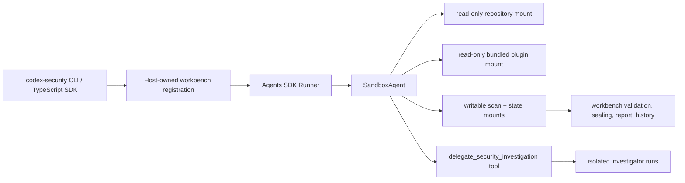

# Agents SDK runtime prototype

This prototype replaces the package runtime dependency on `@openai/codex` and
`@openai/codex-sdk` with `@openai/agents`. The Codex Security artifact
contract, bundled skills, Python helpers, and SQLite workbench remain the
same.

## What changes

- `src/agents-runtime.ts` creates one Agents SDK `Runner` and `SandboxAgent`
  per scan, streams its events through the existing scan-event adapter, and
  closes the sandbox session when the scan settles.
- The sandbox manifest mounts the target repository and bundled plugin
  read-only, while the registered scan directory, workbench state directory,
  and per-scan model-visible runtime directory are writable. The host-owned
  credential home is never mounted.
- API keys are passed to a per-run `OpenAIProvider`, excluded from the sandbox
  environment, and Agents SDK tracing is disabled with sensitive trace data
  disabled.
- Standard and deep scans retain the existing skill prompts and canonical JSON
  contract. The parent receives a `delegate_security_investigation` agent tool
  for baseline, focused, and repeated deep-discovery work.
- The host still registers scans before execution, validates canonical
  artifacts afterward, seals the contract, generates `report.md`, and shares
  results through the same workbench database.

## Isolation model

- macOS and Linux use `UnixLocalSandboxClient` with a fresh workspace and
  narrow local bind mounts.
- Windows uses `DockerSandboxClient`; set
  `CODEX_SECURITY_AGENTS_DOCKER_IMAGE` when the default
  `python:3.12-bookworm` image is not suitable.
- The repository mount is read-only and the model receives no API key, token,
  secret, password, or credential environment variables.
- The existing plugin instructions still require offline source review. This
  prototype does not expose web tools.

## Compatibility changes

- ChatGPT login, device login, and access-token login are unavailable because
  the Agents SDK authenticates through API credentials. Use
  `OPENAI_API_KEY`, `CODEX_API_KEY`, or
  `codex-security login --with-api-key`.
- Stored credentials now live in the existing private Codex Security runtime
  home as `agents-auth.json`; they are not imported from ambient Codex homes or
  mounted into the model-visible sandbox.
- `codexOverrides` remains accepted for compatibility. Model, reasoning effort,
  and multi-agent concurrency are projected into Agents SDK settings; Codex
  plugin-loading and native sandbox options no longer apply.
- OpenAI-compatible external providers continue through their configured base
  URL. Amazon Bedrock needs a dedicated Agents SDK provider before it can be
  supported.
- `validate` and `patch` still use the legacy Codex skill-command path and are
  intentionally outside this scan-runtime prototype.

## Production follow-ups

1. Replace the remaining `validate` and `patch` skill-command path with
   Agents SDK agents.
2. Add a dedicated Bedrock model provider and decide whether ChatGPT account
   authentication remains a supported product requirement.
3. Exercise real scan fixtures on Unix-local and Docker-backed sandboxes,
   including deep-scan saturation and post-scan prompts.
4. Decide whether Unix-local isolation is sufficient or production scans should
   require Docker or a hosted sandbox client.
5. Remove legacy Codex bootstrap/auth exports after a compatibility window.
